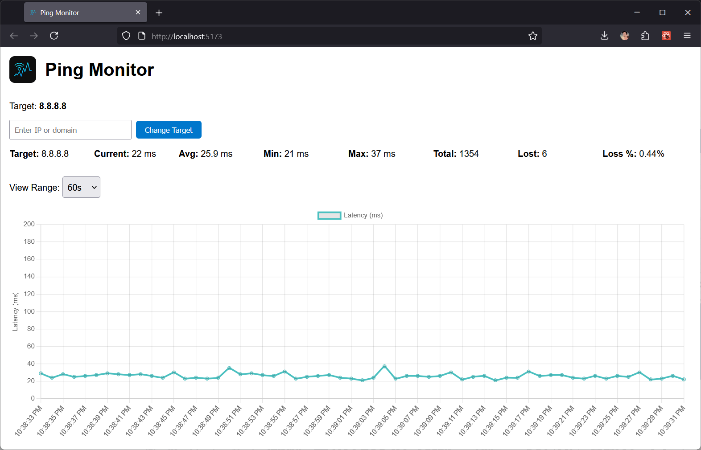

# Ping Monitor


[](./CHANGELOG.md)


📡 A simple, lightweight, real-time web app to monitor internet connection stability. Built with Node.js, Express, React and Chart.js — runs locally on `localhost`.


_Track your ping in real time with a clean, interactive latency graph._

## 🔧 Features

- 📊 Real-time latency graph (smooth and responsive)
- ⏱ Dynamic time range selector (60s to full session)
- 🧠 Live statistics: average, min, max and current latency
- ❌ Packet loss tracking (count & %)
- 🌐 Change ping target (IP or domain) without restarting
- 💡 Runs on `localhost`, no cloud or desktop install

## 📦 Tech Stack

- **Backend**: Node.js + Express + `ping`
- **Frontend**: React + Chart.js (`react-chartjs-2`)
- **No database** — data is stored in memory per session

## 🚀 Getting Started

### 1. Clone the repo

```bash
git clone https://github.com/OleksandrZadvornyi/ping-monitor.git
cd ping-monitor
```

### 2. Install backend dependencies

```bash
cd backend
npm install
```

### 3. Start backend server

```bash
node server.js
# Runs on http://localhost:3001
```

### 4. Set up the frontend

```bash
cd ../frontend
npm install
npm run dev
# Open http://localhost:5173
```

## 🔍 Usage

- The graph starts by pinging `8.8.8.8` by default
- Use the input field to enter a new IP or domain and hit **Change Target**
- Select a view range (e.g. "5m", "1h") to zoom in or out
- Watch live latency changes and packet loss stats update

## 📁 Project Structure

```
ping-monitor/
├── backend/
│   ├── server.js          # Express API and ping loop control
│   └── pingWorker.js      # Handles pinging and target switching
├── frontend/
│   ├── src/
│   │   ├── components/
│   │   │   └── LatencyGraph.jsx
│   │   └── App.jsx
```

## 📝 Future Improvements

- 🔴 Plot red spikes for packet loss
- 💾 Export data to CSV
- 🌙 Dark mode
- 💡 System tray / background mode

## ❓ FAQ

### Why does this run on localhost?

This app is intentionally local-only for two main reasons:

- Privacy & security — Your connection info stays on your machine
- Low latency — It's meant for real-time monitoring during gaming

If hosted remotely, it wouldn’t accurately measure your own ping, but rather the ping between the server and the target.

## 📄 License

MIT
